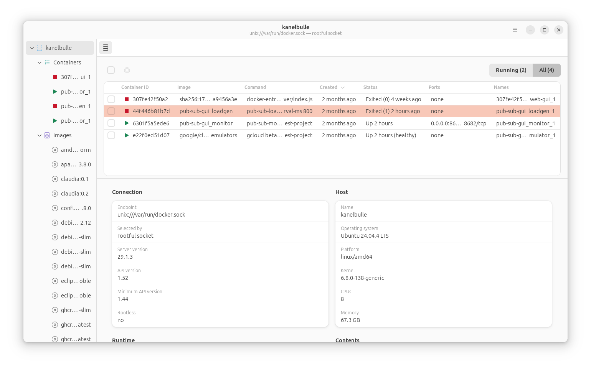

# Lave Station

A Gtk Based GUI for Docker, implemented in Rust, using native control of Docker.



Provides:
  * Visual list of running and/or stopped containers
  * Visual list of images
  * Control over all containers and images
  * Log viewers
  * Container and image metadata

# AI Declaration

This tool is pretty much pure vibe-coded with Claude Code to scratch my own itch!

# Installing

For Debian Trixie you can download the `.deb` from the 
[releases page](https://github.com/dcminter/lave-station/releases) and install it
with `apt`, which will pull in the GTK and libadwaita runtime for you:

```
sudo apt install ./lave-station_0.1.0-1_amd64.deb
```

# Building and running

Build prerequisites (Debian 13):

```
sudo apt install build-essential pkg-config libgtk-4-dev libadwaita-1-dev
```

`glib-compile-schemas`, which the build runs, comes with `libglib2.0-dev` — a dependency
of `libgtk-4-dev`, so installing the above is enough.

Lave Station targets **GTK 4.14 or newer** and **libadwaita 1.5 or newer**, which means
Ubuntu 24.04 LTS, Debian 13, or anything more recent.

Then:

```
cargo build
cargo run -p lave
```

Options: `--docker-host <URL>` overrides `DOCKER_HOST` and any active Docker context,
`--log-level <level>` sets verbosity, and `--no-indicator` suppresses the panel
indicator.

View preferences - the sidebar width, view toggles on lists, and table column widths
are stored in GSettings under `com.paperstack.LaveStation`. Sort order is not stored
beyond the session lifetime.

The schema is also compiled with `cargo build` into the build directory, so an 
uninstalled run finds it without anything being installed system-wide. If it 
exists then a copy under `/usr/share/glib-2.0/schemas` takes precedence.

To read or reset the settings by hand, point `gsettings` at the compiled copy:

```
SCHEMAS=$(find target/debug/build -type d -name schemas | head -1)
gsettings --schemadir "$SCHEMAS" list-recursively com.paperstack.LaveStation
gsettings --schemadir "$SCHEMAS" reset-recursively com.paperstack.LaveStation
```

## The panel indicator

The activity monitor is published as a StatusNotifierItem. KDE, Xfce, Cinnamon and MATE
show these natively. **GNOME does not**, so it needs an extension:

```
sudo apt install gnome-shell-extension-appindicator
```

Enable it and log out and back in. Without a StatusNotifier host the tool will
close the session entirely on window close.

## Browsing a container in your file manager

Selecting a container and choosing **Open in Files** mounts its filesystem read-only
under `$XDG_RUNTIME_DIR/lave-station/` and then hands the directory to the desktop
directory browser via XDG Desktop Portal. This needs `fusermount3`, which is in 
the `fuse3` package:

```
sudo apt install fuse3
```

The mount point is lazy; nothing will be transferred until a read is attempted. The
mount is read-only and the mount only exists while the application is running.

Image (rather than container) browsing is managed entirely within the app because it needs
a stand-in container for any filesystem to exist.

## Building the package yourself

Packaging is done by [`cargo-deb`](https://github.com/kornelski/cargo-deb) from the
`[package.metadata.deb]` section of `crates/lave/Cargo.toml` — there is no Makefile and
no `debian/` directory to keep in step:

```
cargo install cargo-deb
cargo deb -p lave           # writes target/debian/lave-station_<version>-1_<arch>.deb
```

No maintainer scripts are involved: the dpkg triggers owned by `libglib2.0-0t64` and
`hicolor-icon-theme` compile the settings schema and refresh the icon cache once the
files land.

## Releasing

`.github/workflows/deb.yml` builds and tests the package on a `debian:trixie` container
for every push, and installs the result to prove the package works before keeping it.
Pushing a `v*` tag attaches the `.deb` to a GitHub release of the same name:

```
git tag -a v0.1.0 -m "Lave Station 0.1.0"
git push origin v0.1.0
```

Bump `version` in the workspace `Cargo.toml` and add a `<release>` to
`crates/lave/data/com.paperstack.LaveStation.metainfo.xml` before tagging; the Debian
version is taken from the crate version, with a `-1` revision.

# Testing

```
cargo test                                     # No docker daemon required
cargo test --features live-docker              # adds tests against the local docker daemon
cargo test -p lave --features live-gtk         # adds tests that build widgets; needs a display
cargo clippy --all-targets -- -D warnings      # Aggressive clippy review
```

Business logic lives in `crates/lave-core`, which has no GTK or D-Bus dependency, so
`cargo test -p lave-core` runs without GTK development packages or a display.

